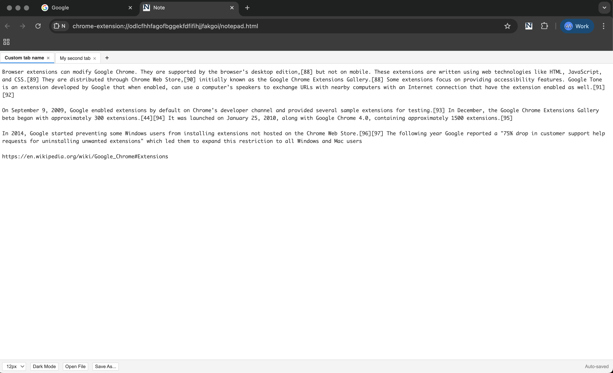
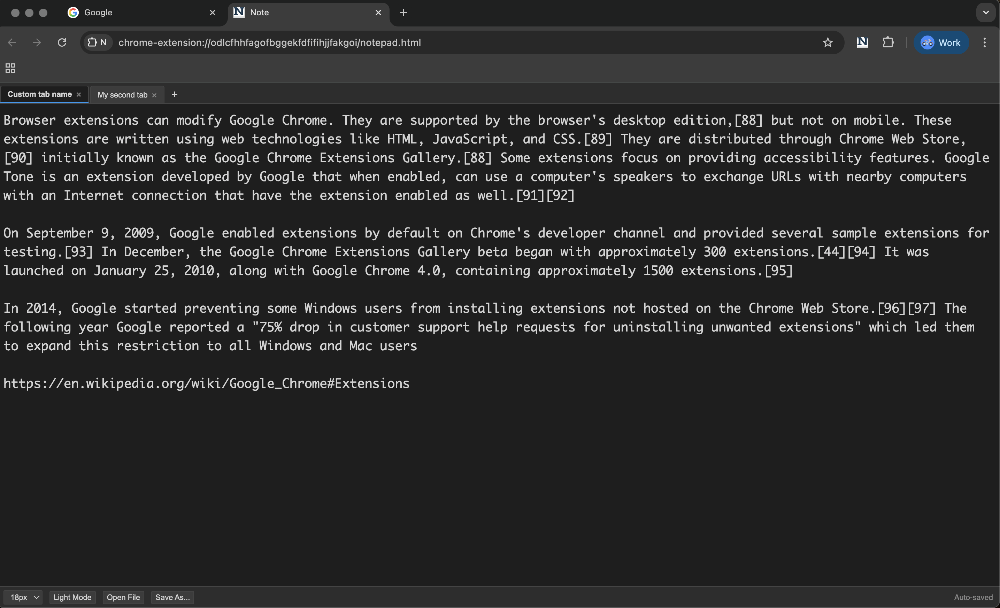

# N - Minimalist and simple full-tab Notepad Chrome extension

**N** is a minimalist and simple Chrome extension that provides a distraction-free writing environment. It allows you to manage multiple notes through a tabbed interface with auto-save functionality.

| Light Mode | Dark Mode |
|---|---|
|  |  |

## ✨ Features

- **Tabbed Interface:** Open and manage multiple notes simultaneously.
- **Auto-Save:** Your notes are automatically saved to Chrome's local storage as you type.
- **Manual Dark Mode:** Toggle between light and dark themes with a single click.
- **Adjustable Font Size:** Customize the editor text size (12px to 24px) for better readability.
- **Rename Tabs:** Double-click any tab title to rename it.
- **File Interoperability:** - **Open File:** Import `.txt` files directly into a new tab.
  - **Save As:** Export your current note to your computer using the native File System API.
- **Persistence:** Your open tabs, active note, theme preference, and font size are all remembered even if you close the browser.

## 🚀 Installation

Since this extension is in development, you can install it manually in Chrome:

1. **Download/Clone** this repository to your local machine.
2. Open Google Chrome and navigate to `chrome://extensions/`.
3. Enable **"Developer mode"** using the toggle in the top-right corner.
4. Click the **"Load unpacked"** button.
5. Select the folder containing the extension files (where `manifest.json` is located).
6. The **N** icon will now appear in your extension toolbar.

## 🛠️ Usage

- **Opening the App:** Click the extension icon in your browser toolbar to open the notepad in a new tab.
- **Adding Notes:** Click the **+** button in the tab bar to create a new note.
- **Renaming:** Double-click on a tab's name to edit it. Press `Enter` to save or `Esc` to cancel.
- **Theme Toggle:** Use the **Dark Mode / Light Mode** button in the bottom toolbar to switch styles manually.
- **Font Size:** Use the dropdown menu in the toolbar to adjust the text size.
- **Closing Notes:** Click the `×` on a tab to delete it (requires confirmation).

## 📂 Project Structure

- `manifest.json`: Extension configuration and permissions.
- `background.js`: Handles the extension icon click to launch the app.
- `notepad.html`: The main user interface and styling.
- `script.js`: Logic for tab management, storage, file I/O, and UI themes.
- `icon.png`: The extension's visual identity.

## 🔒 Permissions

This extension requires:
- `storage`: To save your notes and settings locally on your device.

## 📄 License

This project is open-source and available under the [MIT License](LICENSE).
